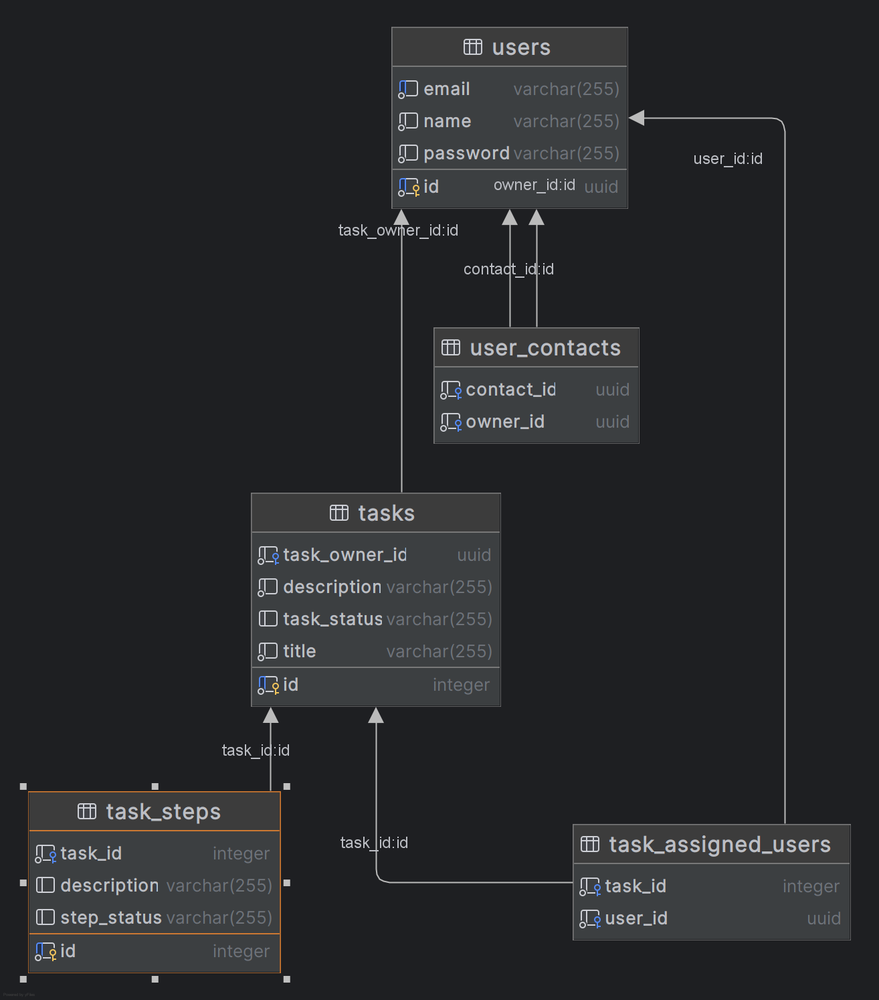

# ToDo Things API 🧠

> Uma API de gestão pessoal e colaborativa, voltada para controle de tarefas, visando construir uma rotina saudável e uma boa organização.

## 👥 Colaboradores
- Caio Lopes
- Gabriel Rabello

## 🧬 Tecnologias Utilizadas


## 🏦 Entidades e Estrutura de Dados

### User (Usuário)
Representa o usuário do sistema.
- `id` (UUID)
- `name` (String)
- `email` (String - Único)
- `password` (String - Criptografada)
- `contacts` (Lista de usuários adicionados como contato)

### Task (Tarefa)
Representa as tarefas criadas.
- `id` (Integer)
- `title` (String)
- `description` (String)
- `taskStatus` (Enum: PENDENTE, PAUSADO, CANCELADO, EM_ANDAMENTO, CONCLUIDO)
- `taskOwner` (User - Dono da tarefa)
- `assignedUsers` (Lista de usuários atribuídos à tarefa)
- `taskSteps` (Lista de passos da tarefa)

### TaskStep (Passos da Tarefa)
Sub-tarefas ou checklist dentro de uma tarefa maior.
- `id` (Integer)
- `description` (String)
- `stepStatus` (Enum)
- `task` (Referência à tarefa pai)

### ChatMessage (Mensagens do Chat da Task)
Sub-tarefas ou checklist dentro de uma tarefa maior.
- `id` (UUID)
- `task_id` (ID)
- `content` (String)
- `sendAt` (DateTime)
- `sender` (Referência ao usuario)
- `task` (Referência à task)
---
[]()

## 📍 Rotas da API

### Autenticação & Usuário (`/api/auth` e `/api`)
| Método | Rota | Descrição |
|---|---|---|
| `POST` | `/api/auth/register` | Registra um novo usuário |
| `POST` | `/api/auth/login` | Realiza login e retorna o Token JWT |
| `GET` | `/api/me` | Retorna os dados do usuário logado |
| `PATCH` | `/api/me` | Atualiza os dados do usuario |
| `POST` | `/api/contact` | Adiciona um novo contato à lista do usuário logado |
| `POST` | `/api/logout` | Realiza logout (Stateless) |

### Tarefas (`/api/task`)
| Método | Rota | Descrição |
|---|---|---|
| `POST` | `/api/task` | Cria uma nova tarefa |
| `GET` | `/api/task` | Lista todas as tarefas do usuário logado |
| `GET` | `/api/task/{id}` | Busca uma tarefa específica pelo ID |
| `PATCH` | `/api/task/{id}` | Atualiza dados de uma tarefa |
| `DELETE` | `/api/task/{id}` | Remove uma tarefa |
| `GET` | `/api/task/export` | **Exporta as tarefas para arquivo CSV** 📤 |

### Colaboração em Tarefas
| Método | Rota | Descrição |
|---|---|---|
| `POST` | `/api/task/{id}/assignuser` | Atribui um usuário (contato) a uma tarefa |
| `DELETE` | `/api/task/{id}/assignuser` | Remove um usuário atribuído da tarefa |

### WebSocket de Chat da Tarefa (Task Chat)
| Método      | Rota                        | Descrição                                                   |
| ----------- | --------------------------- | ----------------------------------------------------------- |
| `CONNECT`   | `/ws?token={jwt}`           | Abre a conexão WebSocket autenticada via Token JWT          |
| `SUBSCRIBE` | `/topic/task/{taskId}/chat` | Inscreve o cliente para receber mensagens do chat da tarefa |
| `SEND`      | `/app/task/{taskId}/chat`   | Envia uma mensagem para o chat da tarefa                    |

### Mensagens
| Método | Rota | Descrição |
|---|---|---|
| `Socket` | `/api/task/{id}/taskstep` | Adiciona um passo a uma tarefa |
| `PATCH` | `/api/task/{id}/taskstep/{stepId}` | Atualiza um passo (ex: marcar como concluído) |
| `DELETE` | `/api/task/{id}/taskstep/{stepId}` | Remove um passo da tarefa |

---

## 🚀 Como executar localmente

### 1. Clonar o repositório
```bash
git clone https://github.com/CaioLopesxd/todoThings
```
